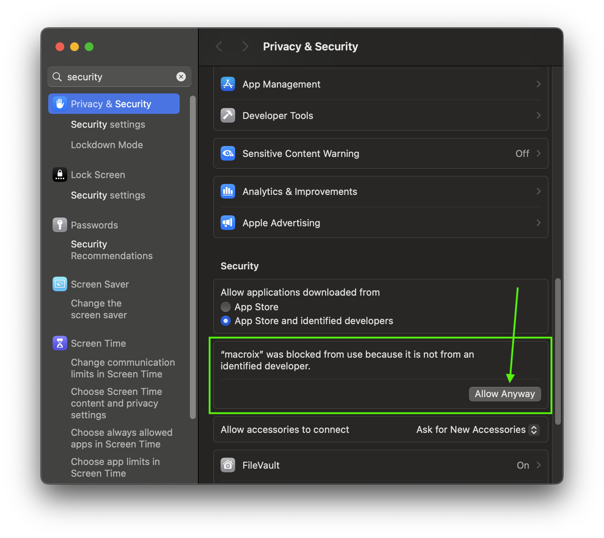

# Drum Break

Drum Break is an experimental drum training tool.

By plugging your electronic drums into your computer, Drum Break can analyze your playing and give you feedback.
You can use it to structure your practice sessions and level up your skills.

The tool is in an alpha state.

## Download

1. Download the latest [release-<version>.zip](https://github.com/nathanleiby/drum-break/releases) from Github.
2. Unzip it
3. `cd release/`
4. Run `./drum_break`.
   - On Mac, ou will likely need to open your security settings (roughly: https://www.macworld.com/article/672947/how-to-open-a-mac-app-from-an-unidentified-developer.html) and allow it to run.
     

## Development

See [DEVELOPMENT.md](./DEVELOPMENT.md) for more details.
