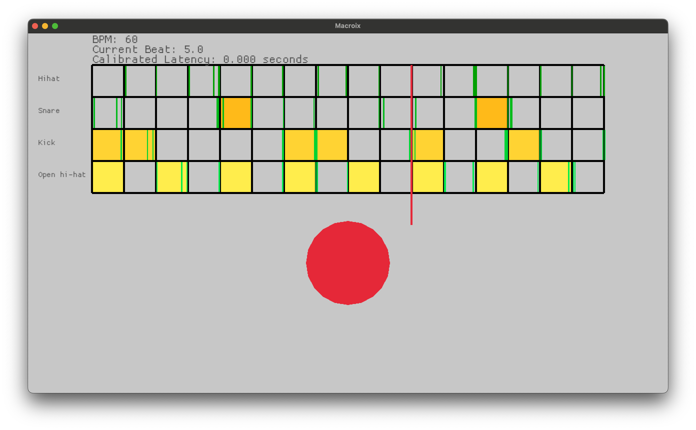
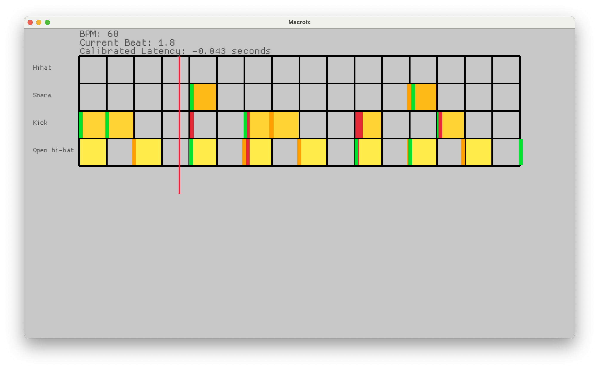

# macroix

Macroix is an experimental drum training tool.

It is called Macroix based on "Macroquad" (rust game engine) + "LaCroix" (sparkling water).

The tool is in a pre-alpha state.

## Download

1. Download the latest [release-<version>.zip](https://github.com/nathanleiby/macroix/releases) from Github.
2. Unzip it
3. Run it: `./macroix` - you will likely need to open your security settings in Mac (roughly: https://www.macworld.com/article/672947/how-to-open-a-mac-app-from-an-unidentified-developer.html) and allow it to run

### Testing goals

- does it run?
- can you calibrate the audio latency?
- does it work with your midi input device (e.g. Akai MPK Mini, Alesis Nitro, TD17)?

## Development

### Running

- install rust: https://www.rust-lang.org/tools/install
- clone this repo
- run it: `cargo run`

### Creating a release

- update the `VERSION` file
- run `./release.sh`
- `gh release create "$(cat VERSION)" release-$(cat VERSION).zip`
  - versioning scheme is semver with leading `v`, e.g. `v0.0.1`
