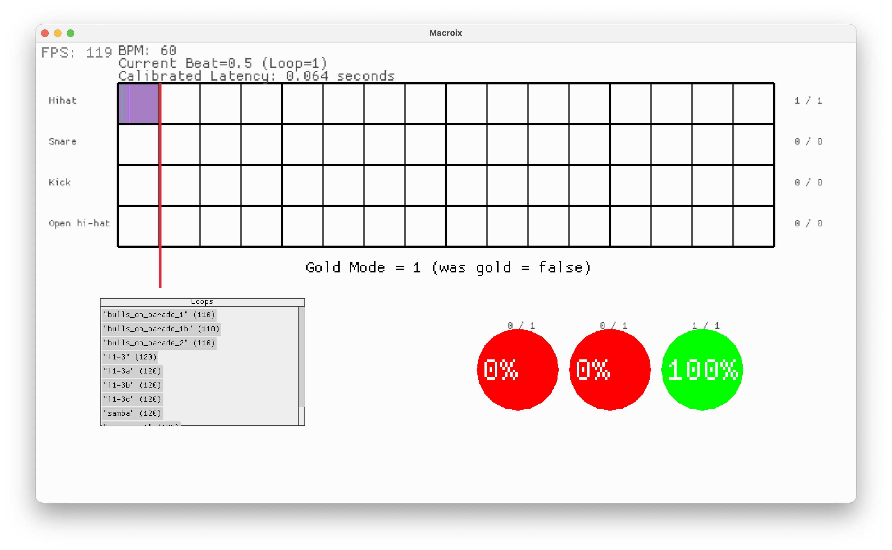
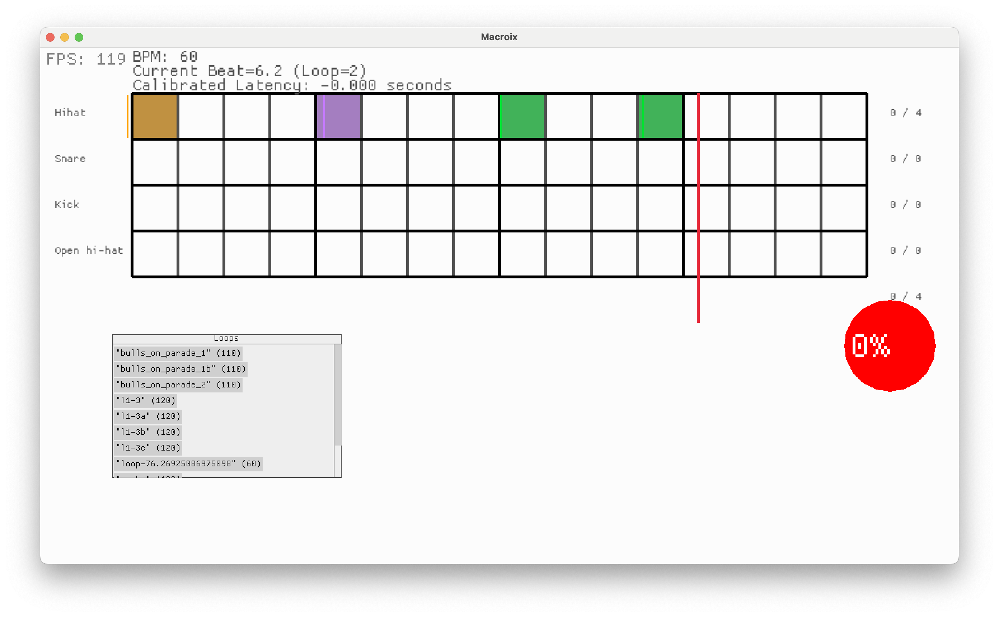
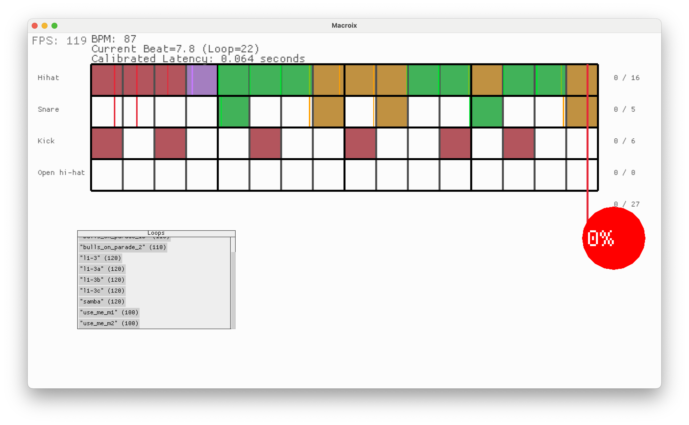
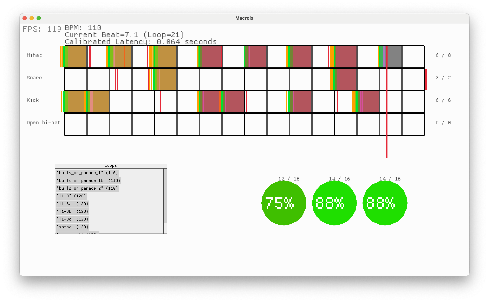

# Dev Log

## Jul 3 - Gold Mode

    Design:
    Emit an event whenever a loop completes. [x]
    This event should include the loop's summary.

    Gold mode tracking maintains state of `num_consecutive_aces`
    If event was 100%, the `num_consecutive_aces += 1`
    else `num_consecutive_aces = 0`
    if num_consecutive_aces == GOLD_MODE_CORRECT_TAKES {
         increase BPM
         num_consecutive_aces = 0
         // notify user in UI - "aced! BPM += {GOLD_MODE_BPM_STEP}" or similar
    }

## July 2 - Per note accuracy

Per note accuracy

2nd pass Jul 2:

summary metrics for last 3 loops.
also shows that we don't report note status until it has passed in current loop

